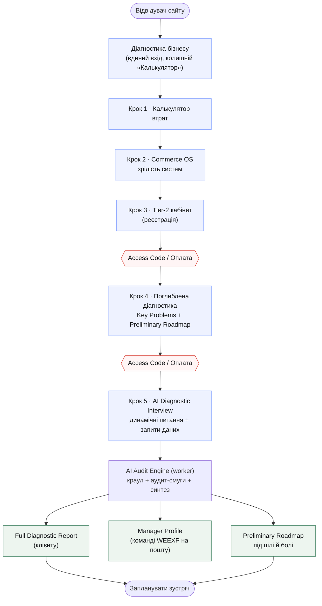
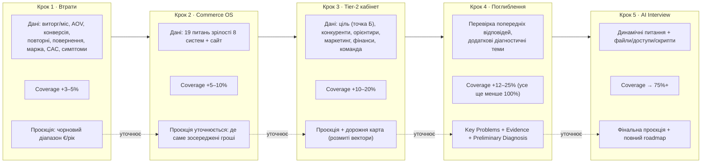
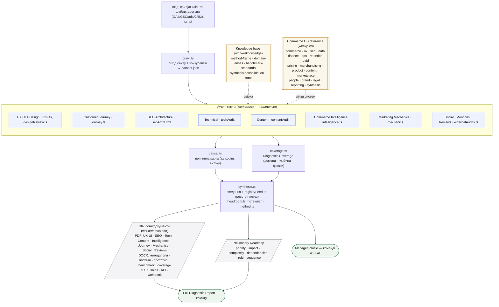
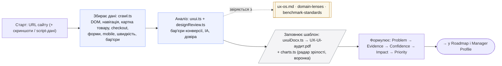
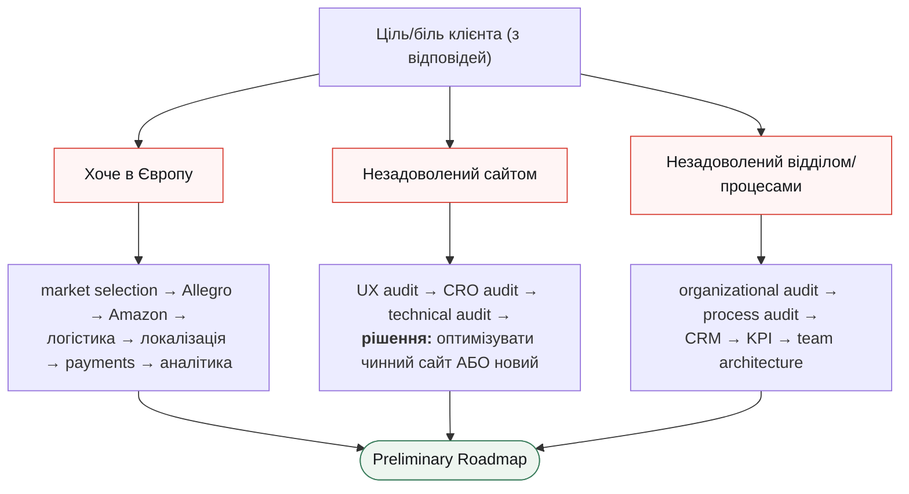

# WEEXP · Commerce OS — карта механіки аудиту

> Повний шлях: з чого починається, як проходить, які дані збираються на кожному етапі,
> які шаблони й документи генеруються, які бази знань підключаються.
> **Це редаговане джерело** — GitHub рендерить Mermaid автоматично. Правте текст діаграм нижче,
> і картинка перебудується. Кольори/підписи/звʼязки — усе змінюється тут.

Легенда: `Крок N` — клієнтські етапи воронки · `[[…]]` — бази знань · `[/…/]` — шаблони/документи · `{{…}}` — ворота (оплата/код).

---

## 1. Огляд — весь шлях за 30 секунд



---

## 2. Клієнтська воронка — дані + глибина покриття на кожному кроці

`Diagnostic Coverage` росте поетапно й **ніколи не дорівнює 100% до Кроку 5**.
Проєкція «Зараз → Куди прийдемо» **не збирається наново** — кожен крок її **уточнює**.



---

## 3. AI Audit Engine (worker) — краул → аудит-смуги → знання → синтез → документи

Кожна смуга: **старт → збирає дані → звіряється з базою знань → заповнює шаблон**.



---

## 4. Приклад однієї смуги — UX/UI аудит (як читати будь-яку смугу)



---

## 5. Логіка roadmap за болями/цілями (векторні приклади)



> **Важливо (з ТЗ):** система не робить категоричний висновок «потрібен новий сайт» з одного субʼєктивного
> «сайт поганий». Спершу — перевірка UX / аналітики / конверсії / технічних сигналів → лише потім рішення
> «оптимізація vs новий сайт» (Problem → Evidence → Confidence → Impact).

---

## Як редагувати

- Правте будь-який блок ```mermaid``` вище — назви вузлів у `[ ]`, звʼязки `-->`, підписи на стрілках `-->|текст|`, кольори у `classDef`.
- GitHub перемальовує діаграму автоматично при перегляді цього файлу.
- Для швидкої візуальної правки можна вставити блок у https://mermaid.live — і повернути змінений текст сюди.
